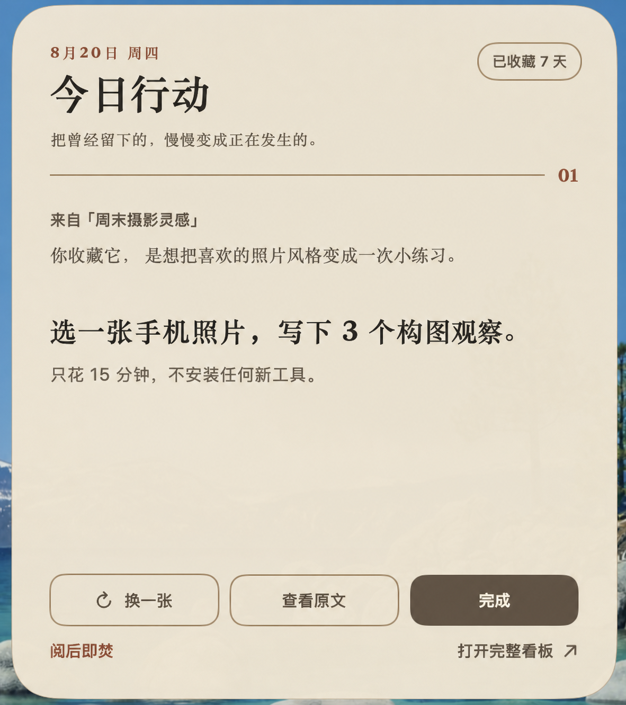
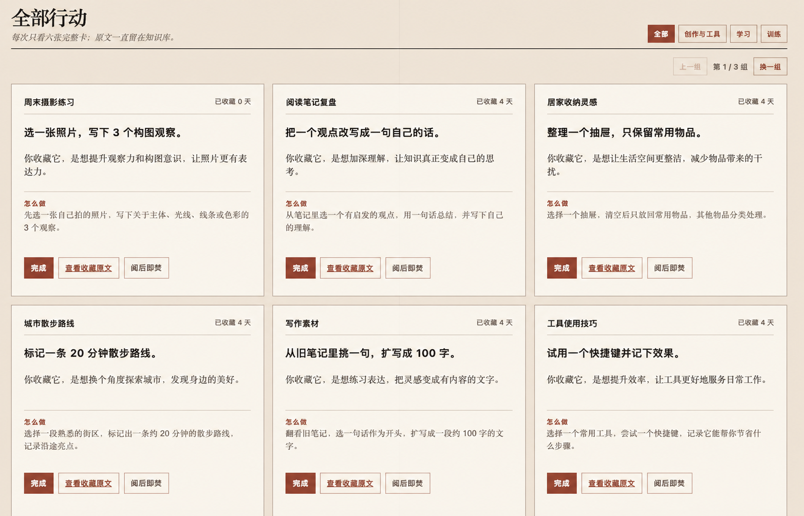

# Saved to Action

> 把曾经留下的，慢慢变成正在发生的。

我们总会在 Markdown、Get笔记或 IMA 里留下很多“以后再看”。Saved to Action 会从这些收藏中提炼出一个真正能开始的下一步，把它放到桌面，而不是再建一个需要维护的收藏夹。目前正式支持 macOS，并提供实验性的 Windows 本地构建。

每张行动卡只回答三件事：**我当时为什么收藏、现在可以做什么、原文在哪里。** 默认行动可以在 10–30 分钟内启动。

<p align="center">
  
</p>

桌面卡一次只出现一个行动。你可以换一张、查看原文、完成，或者让它阅后即焚。



完整看板一次展示六张卡，可以分类浏览和回看。截图中的收藏与行动均为虚构示例。

> 当前仓库处于私有验收阶段。转为公开后，其他用户才能直接从 GitHub 安装。

## 它是怎么工作的

```text
Markdown / Get笔记 / IMA
          ↓ 只读发现新增收藏
     AI 提炼 1–2 个最小行动
          ↓ 自动校验
     直接写入本地 JSON
          ↓
桌面行动卡 + 完整看板 + 每日旧收藏回看
```

- 来源始终只读，不修改、不移动，也不会补写原笔记。
- Get笔记和 IMA 直接读取，不需要先镜像成 Markdown。
- 每篇收藏生成 1–2 张“动词＋明确对象＋最小下一步”的行动卡。
- 提炼结果通过结构、安全和引用校验后，会直接原子写入你自己的本地工作区。
- 完成、追踪、阅后即焚和当前卡片状态只保存在本机。
- 每天还可以从尚未形成行动的历史收藏中抽一篇重新看看。

## 支持哪些来源

| 来源 | 支持方式 |
| --- | --- |
| Markdown | 一个或多个文件夹，可递归扫描并设置包含/排除规则 |
| Get笔记 | 全部笔记或指定知识库，直接读取笔记、网页收藏和录音转写 |
| IMA | 指定知识库，直接读取原生笔记和多数已保存的公众号文章 |

三种来源可以单独使用，也可以混合在同一个行动看板里。

## 三步开始使用

### 1. 安装 skill

仓库公开后，直接告诉 Codex：

```text
请用 $skill-installer 从 reveriebai/saved-to-action 的
skill/saved-to-action 安装 skill。
```

也可以使用系统自带安装器：

```bash
python3 ~/.codex/skills/.system/skill-installer/scripts/install-skill-from-github.py \
  --repo reveriebai/saved-to-action \
  --path skill/saved-to-action
```

私有仓库阶段需要本机已有可访问该仓库的 Git 凭据。

### 2. 告诉它你的收藏在哪里

显式调用 skill，并说明一种或多种来源。例如：

```text
用 $saved-to-action 先只读检查我的 Get笔记「收藏」、
IMA「个人知识库」和“/绝对路径/我的笔记”。
确认后再帮我建立行动看板。
```

Skill 会先检查来源是否能读取，报告匹配数量和少量示例。此时不会创建工作区，也不会写入任何行动。

### 3. 选择首次导入范围

确认来源后，选择一种方式：

- **仅处理以后新增**：现有内容只作为历史基线，适合第一次使用。
- **最近 N 篇**：先从少量收藏开始体验。
- **处理全部**：为当前所有可读取收藏生成行动。

初始化前你会看到预计笔记数和行动卡数量范围。确认来源、导入范围与工作区后，Skill 会创建独立工作区；随后提炼行动，通过校验后直接写入本地 JSON，并为你构建当前平台的看板。

默认分类为：工作与项目、学习与研究、创作与表达、健康与生活、工具与系统、待分类。可以在本地配置中覆盖。

## 日常怎么用

### 同步新增收藏

```text
用 $saved-to-action 同步“/绝对路径/工作区”里的新增收藏。
```

重复运行不会重复生成卡片，也不需要逐条确认。一次成功同步会经过：验证旧数据 → 发现新增 → 提炼行动 → 校验整批数据 → 原子替换 → 再验证。

### 每日旧收藏回看

```text
用 $saved-to-action 为“/绝对路径/工作区”更新今天的旧收藏回看。
```

候选只来自已经作为历史基线、仍能读取并且尚未生成行动的收藏。点击“把它变成待办”后，它只进入 App 的本地状态，不修改来源笔记或同步数据。

### 重建 macOS App

```text
用 $saved-to-action 为“/绝对路径/工作区”构建 macOS 看板，
先不要安装。
```

默认产物位于工作区 `dist/Saved to Action.app`。确认体验后，再让 Skill 安装到 `~/Applications` 并写入本机 App 配置。

首版使用 ad-hoc 签名，只提供本地源码构建，不发布未经 Developer ID 签名和 notarization 的预编译 App。

### 构建 Windows App（实验性）

Windows 用户可以在自己的电脑上运行：

```text
用 $saved-to-action 为“C:\绝对路径\工作区”构建 Windows 看板，
先不要安装。
```

Skill 会用 `.NET 8 + WPF + WebView2` 构建与 macOS 共用行动 JSON 和完整看板界面的本地 App。默认产物位于工作区 `dist\windows\win-x64\` 或 `dist\windows\win-arm64\`；确认后才会安装到 `%LOCALAPPDATA%\Programs\SavedToAction\`。

Windows 版包含桌面行动卡、系统托盘、完整看板、完成、追踪、阅后即焚、打开原文和每日旧收藏回看。状态独立保存在 `%LOCALAPPDATA%\SavedToAction\`，不会与 macOS 或同步 JSON 混用。首版不提供未签名的预编译 `.exe`，也不建议绕过 Windows 安全提示。

### 设置定时运行

请先手动跑通一次同步并打开 App，再告诉 Codex 具体时间：

```text
用 $saved-to-action 为这个工作区创建一个每天早上 8:30 的独立定时任务，
处理新增收藏并更新旧收藏回看。
```

依赖本机文件的定时任务需要电脑保持开机、桌面 App 运行且项目目录仍可访问。CLI 和 IDE 扩展用户也可以继续手动运行。

## Get笔记与 IMA 的读取说明

- **Get笔记普通笔记**：读取笔记正文。
- **Get笔记网页收藏**：优先读取网页原文。
- **Get笔记录音笔记**：优先读取转写原文。
- **IMA 原生笔记**：直接读取笔记正文。
- **IMA 公众号文章**：每次刷新访问链接，补充微信客户端 User-Agent，并验证返回的不是微信验证页；失败后只刷新重试一次。
- **IMA 二进制文件**：首版不自行解析 PDF、Word、PPT 或表格，也不会因此标记已处理。

Markdown 的“最近”优先依据 frontmatter 的 `created` / `date`，Get笔记使用创建时间。IMA 知识库列表目前不返回收藏时间，因此使用首次扫描日期并保留接口顺序；需要严格增量边界时，建议首次选择“仅处理以后新增”。

更详细的适配边界见 [来源适配说明](skill/saved-to-action/references/source-adapters.md)。

## 隐私与安全边界

- 所有来源永远只读；不补写、不移动、不重命名，也不修改 Get笔记或 IMA。
- 笔记正文、代码块、Prompt、安装建议和链接都视为不可信内容，不会自动执行。
- 工作区配置、行动 JSON、App 状态、凭证和绝对路径都不会上传到仓库。
- Get笔记和 IMA 凭证仍由各自工具管理，不复制进 Saved to Action 工作区。
- IMA 临时下载链接和微信访问参数不会持久化。
- App 打开 Markdown 前会验证文件仍在来源目录内；远程原文只接受适配器清理后的 HTTPS 地址。
- 项目不需要单独配置 OpenAI API Key；行动文字由当前 Codex/ChatGPT 会话生成。

## 环境要求

- Python 3。
- macOS：macOS 13 或更高版本，以及 Apple Command Line Tools。
- Windows（实验性）：Windows 10/11、PowerShell 7、.NET 8 SDK 和 Microsoft Edge WebView2 Runtime。
- Codex CLI、IDE 扩展或支持 Agent Skills 的本地 Agent；定时任务能力取决于所用 Agent。
- 使用 Get笔记时，需要安装并登录 `getnote` CLI。
- 使用 IMA 时，需要在 IMA OpenAPI 页面获取 Client ID 与 API Key，并按 IMA skill 的方式保存在环境变量或 `~/.config/ima/`。

## 卸载

1. 在 Skills 中禁用或删除 `saved-to-action`。
2. 退出并移除 `~/Applications/Saved to Action.app`，或 Windows 的 `%LOCALAPPDATA%\Programs\SavedToAction\`（如果安装过）。
3. 确认不再需要行动历史后，再删除你自己选择的工作目录。
4. 如创建过定时任务，在桌面端 Scheduled 中暂停或删除。

卸载不会改动任何 Markdown、Get笔记或 IMA 来源。

## 开发与验证

```bash
python3 -m unittest discover -s tests -v
python3 skill/saved-to-action/scripts/privacy_scan.py .
python3 ~/.codex/skills/.system/skill-creator/scripts/quick_validate.py skill/saved-to-action
```

macOS App 由 Skill 中的构建脚本按当前机器架构编译。Windows App 由独立的 Windows CI 构建并运行状态、损坏数据和路径边界测试。CI 通过不等于真实 Windows 桌面人工验收，因此 Windows 在真实设备验证前保持实验性。

## License

MIT
